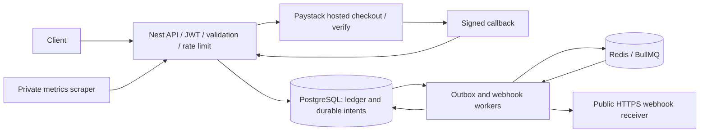

# Architecture and trust boundaries

The ledger is the authority for money. A sealed transaction has balanced immutable postings;
wallet balances are checked snapshots. Transfers, full reversals and verified funding use the
same ledger write path and database checks. Registration owns wallet creation; authorization
is derived from the verified JWT, never a body-supplied user ID. Money uses BIGINT internally
and strings in JSON. Lock ordering and serializable transactions fence concurrent settlement.

Payment intent is persisted before external I/O. Mock verification is available only outside
production. Paystack signatures authenticate callback bytes; server-to-server verification
proves settlement, and stable provider event identities fence replay and reconciliation races.
Checkout claims survive ambiguous network failures; the system favors operator reconciliation
over speculative retry. No raw card data or reusable authorization is stored.

Outbox events commit with business changes; workers dispatch asynchronously. Notification
persistence is idempotent, but a published queue job is not proof of recipient delivery.
Outbound webhooks use encrypted per-subscription secrets, DNS/address validation, IP pinning,
short deadlines, bounded retries and fenced leases. A shared key is required across API/workers.

Operational Redis connections bound request time and fail authentication closed. Rate limits
are per socket IP and shared across API replicas. Metrics require a separate secret. The API
and worker are separate processes; an API readiness response does not certify worker progress.
Infrastructure and credential provisioning remain outside application code.
